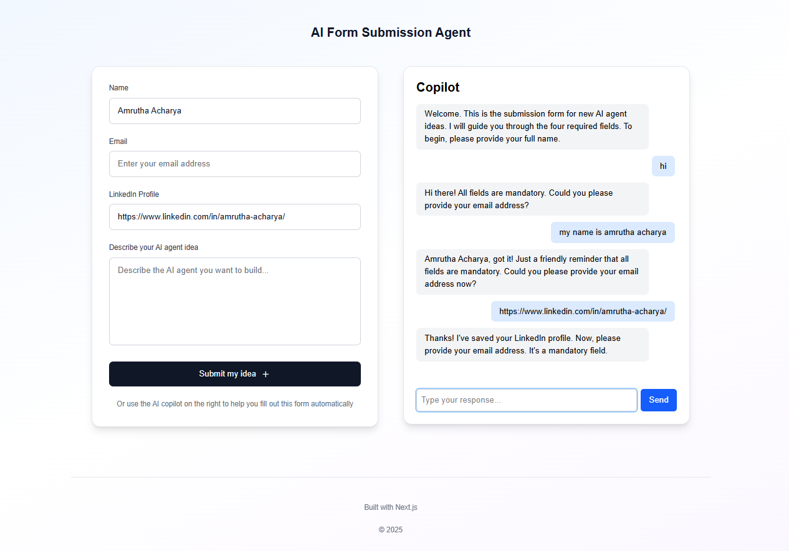
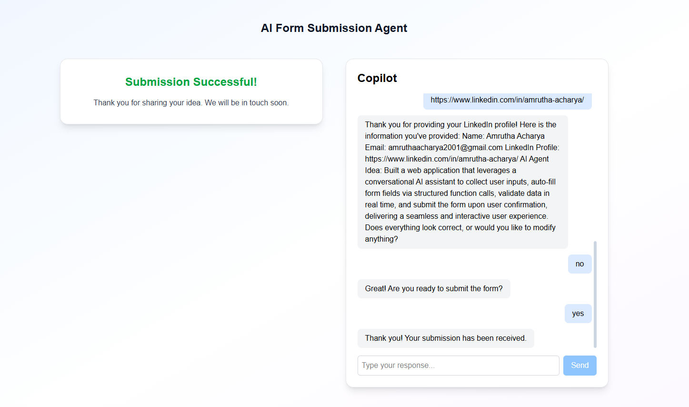

# 💡 AI Form Submission Agent

This project is a conversational AI-powered form submission app built with **Next.js 14**, **TypeScript**, **Tailwind CSS**, and the **Google Gemini API**. It allows users to submit their AI agent ideas by either manually filling out a form or by interacting with an AI copilot that guides them step-by-step.

---

## 🧠 Features

☑️ **Conversational AI Assistant (Copilot)**  
&emsp;Guides the user through all required fields (Name, Email, LinkedIn Profile, AI Agent Idea) using Gemini's function calling.

☑️ **Form Auto-fill via AI**  
&emsp;As the user chats, the AI intelligently extracts and fills in form data using structured function calls.

☑️ **Manual Form Entry**  
&emsp;Users can also fill out the form manually through a clean, user-friendly UI.

☑️ **Validation & Correction**
-  Name is capitalized properly  
-  Email is validated for format  
-  Agent idea is grammar-corrected and capitalized  
-  All fields are mandatory

☑️ **Final Review & Confirmation**  
&emsp;Once all data is collected, the copilot summarizes and confirms before submitting.

---

## 🧩 Component Structure

**`AgentForm.tsx`**
-  Displays the form with inputs for name, email, LinkedIn, and idea  
-  Handles controlled inputs  
-  Triggers submission callback  

**`AICopilot (in page.tsx)`**
-  Maintains conversation with Gemini model  
-  Calls backend API (`/api/gemini`) to process user inputs  
-  Extracts structured data and updates form  

**`app/api/gemini/route.ts` (Server-side API Route)**
-  Uses Google Generative AI SDK (Gemini 2.5 Flash)  
-  Defines two functions:  
  - `update_form_data`: updates name, email, LinkedIn, or idea  
  - `submit_form`: triggers final submission  
-  Handles validation, formatting, and two-turn conversation logic  

**`page.tsx`**
-  Combines both form and chat in a responsive two-column layout  
-  Handles message state, form state, and submission flow  
-  Displays success message on form completion  

---

## 🎯 Submission Flow (AI Copilot)

1. Greets user and asks for Name  
2. Validates, updates, then asks for Email  
3. Repeats for LinkedIn and AI Idea  
4. Once all data is collected:  
   -  Summarizes info  
   -  Asks user to confirm or modify  
5. On confirmation, asks “Ready to submit?”  
6. On 'yes', calls `submit_form` and ends with a success message  

---

## 🛠 Tech Stack

-  **Framework:** Next.js 14 (App Router)  
-  **Styling:** Tailwind CSS  
-  **Language:** TypeScript  
-  **AI API:** Google Generative AI (Gemini 2.5 Flash) with Function Calling  

